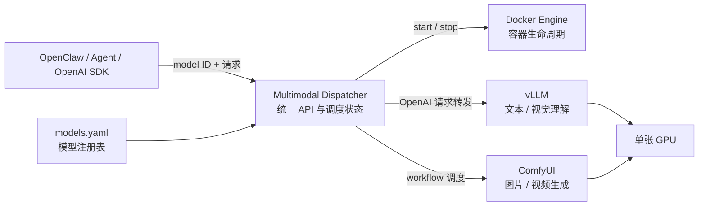
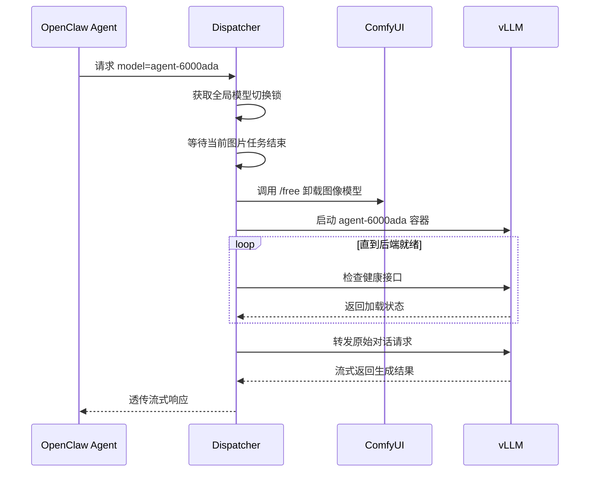

# Multimodal Dispatcher

一个面向单机单 GPU、显存有限环境的多模态模型调度器。

它在客户端与 vLLM、ComfyUI 等推理后端之间提供一个稳定入口，根据请求里的模型 ID
自动等待、释放、启动和切换后端。OpenClaw、AI Agent 或普通 OpenAI SDK 无需了解模型容器
当前是否运行，也不需要执行 Docker 命令。

## 为什么需要 Dispatcher

一张 GPU 往往无法同时容纳通用大模型、代码模型、图像模型和视频模型。直接把所有服务常驻会
耗尽显存；让调用方自己启停 Docker，又会把基础设施细节泄漏到每个 Agent 和用户。

Dispatcher 将这些问题集中到一个控制平面：

- 对客户端暴露稳定的 OpenAI 风格 API 和固定模型 ID。
- 同一时间只让需要的模型占用主要 GPU 显存。
- 跨模型切换前等待正在执行的任务结束，避免中途卸载模型。
- 自动启动目标容器并等待后端真正就绪，再转发原始请求。
- 空闲达到可配置阈值后自动释放显存。
- 提供官方 `modelctl` CLI，方便管理员查看、预热、切换和释放模型。

Dispatcher 不是新的推理引擎：文本生成仍由 vLLM 完成，图片和视频工作流仍由 ComfyUI
完成。它负责统一入口、生命周期和有限 GPU 资源的协调。

## 架构



Dispatcher 与所有后端加入同一个私有 Docker 网络。只有 Dispatcher 需要向客户端开放；
后端端口应仅绑定回环地址或完全不发布。

## 模型自动切换机制

例如 `image-6000ada` 正在占用 GPU，而 Agent 请求 `agent-6000ada`：



切换过程对调用方透明。冷启动时第一次请求会等待模型加载；同一模型的后续请求可并发并直接
转发。最后一个请求结束后开始空闲计时：vLLM 可进入 Sleep Mode，若环境不支持则停止容器；
ComfyUI 调用 `/free` 卸载模型但保留服务进程。

## 支持的接口与后端

| API | 后端 | 说明 |
| --- | --- | --- |
| `GET /v1/models` | Dispatcher | 返回已启用的稳定模型 ID |
| `POST /v1/chat/completions` | vLLM | 普通与 SSE 流式响应透传 |
| `POST /v1/images/generations` | ComfyUI | 固定 API 工作流的文生图适配 |
| `POST /v1/images/edits` | ComfyUI | JSON + base64 图片的图生图适配 |
| `/admin/*` | Dispatcher | 带令牌的状态、预热与释放接口 |

当前仓库里的 Qwen 与 Qwen-Image 配置只是示例。对外模型 ID、容器名、后端地址及能力均由
`config/models.yaml` 声明，可以替换成适合自己硬件的模型。

## 快速开始

完整教程见 [通用部署指南](docs/deployment.md)。最短流程如下：

```bash
git clone https://github.com/yiyang666/multimodal-dispatcher.git
cd multimodal-dispatcher

cp .env.example .env
cp config/models.example.yaml config/models.yaml
# 编辑 .env、models.yaml 和 deploy/ 中的后端示例

docker network create llm-backplane
# 选择并编辑需要的后端示例，然后预先创建容器
docker compose -f deploy/vllm-compose.yaml create
docker compose -f deploy/comfy-compose.yaml create
docker compose up -d --build
./modelctl health
./modelctl list
```

后端容器必须预先创建并加入 `llm-backplane`，但可以保持停止状态；收到请求后由 Dispatcher
自动启动。vLLM、ComfyUI、模型权重和工作流的详细配置见部署指南。

## 官方 CLI

`modelctl` 是随项目提供的零第三方依赖 CLI。它读取项目 `.env`，并通过 Dispatcher 管理
接口操作，不会绕过调度器直接切换 Compose：

```bash
./modelctl list
./modelctl status
./modelctl use agent-6000ada
./modelctl release
./modelctl logs dispatcher -f
```

旧名称 `start`、`switch` 和 `stop` 分别作为 `use`、`use` 和 `release` 的兼容别名保留。
完整说明见 [`modelctl` 使用手册](docs/cli.md)。

## 配置与文档

- [通用部署指南](docs/deployment.md)：从 Docker/GPU 前置条件到后端容器、网络和验收。
- [`modelctl` 使用手册](docs/cli.md)：日常查看、切换、释放和排障。
- [架构设计](docs/architecture.md)：调度状态、并发边界和后端适配方式。
- [运维手册](docs/operations.md)：升级、日志、空闲策略和常见故障。

## 安全边界

Dispatcher 需要挂载 Docker socket 来启停后端容器，这等同于拥有宿主机 Docker 管理权限。
不要将它直接暴露到公网。建议仅监听 `127.0.0.1`、VPN/Tailscale 地址或受控内网，并为
`/admin/*` 使用强随机令牌。业务 API 当前不内置鉴权，公网部署必须在前方增加认证网关。

## License

[MIT](LICENSE) © 2026 yiyang666
