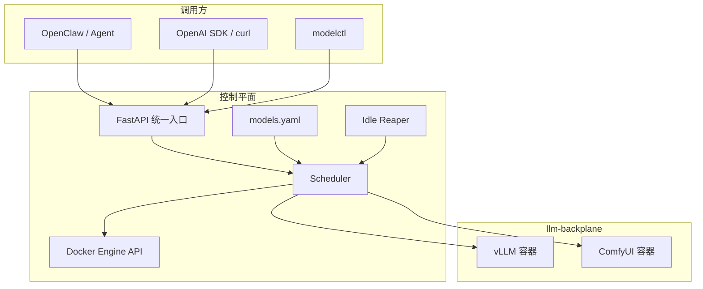
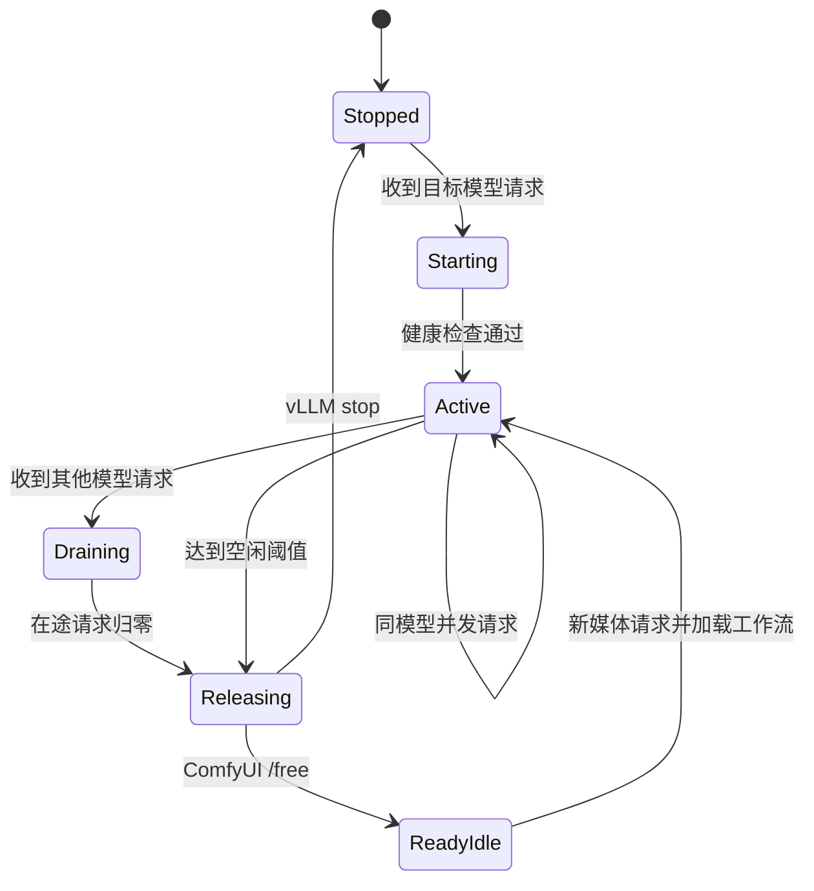

# 架构设计

## 设计目标

Multimodal Dispatcher 面向“模型总量大于单卡显存”的服务器：调用方使用稳定模型 ID，调度器
负责让一个 GPU 在文本、图像和视频后端之间安全让渡。它不替代推理引擎，也不负责训练模型。

核心目标是：

- 客户端只依赖一个稳定 API 地址。
- 后端容器可以预先创建但按需启动。
- 切换不会中断已经接受的请求。
- 空闲模型自动释放主要显存。
- 后端实现和对外模型 ID 解耦。

## 组件

### 模型注册表

`config/models.yaml` 是调度器的模型目录，声明稳定 ID、后端类型、容器名、内部 URL、健康接口、
能力和休眠支持。注册表不创建容器，容器定义由后端 Compose 或其他部署系统负责。

### Scheduler

Scheduler 维护以下进程内状态：

- `active`：当前占有主要 GPU 资源的模型。
- `inflight`：尚未完成的业务请求数。
- `last_activity`：最后一个请求完成或管理员操作的时间。
- 全局切换锁：串行化模型切换、释放和空闲回收。

Dispatcher 重启时会检查已启用且正在运行的后端，恢复活动模型标记，使已有模型仍受空闲策略
管理。实际容器状态始终比内存标记更权威。

### Docker 控制

Dispatcher 通过只挂载于自身容器的 Docker Unix socket 调用 Engine API，只执行检查、启动和
停止已知容器。它不会构建镜像、拉取权重、创建或删除容器。

## 请求与切换状态机

一次业务请求的顺序为：

1. 校验请求中的模型 ID 与启用状态。
2. 获取全局切换锁。
3. 若目标与活动模型不同，等待当前模型的在途请求归零。
4. 让旧后端休眠、停止或 `/free`。
5. 启动或唤醒目标容器，轮询健康接口。
6. 增加在途计数并转发请求。
7. 普通响应读完或流式连接关闭后减少计数，并重新开始空闲计时。

跨模型等待受 `SWITCH_WAIT_TIMEOUT_SECONDS` 限制。超时返回 503，不会强行杀死当前任务。
同模型请求不需要等待切换，可以并发执行。

## 显存释放策略

| 后端 | 首选动作 | 回退动作 | 容器是否保留运行 |
| --- | --- | --- | --- |
| vLLM 且支持 Sleep Mode | `POST /sleep?level=1` | 停止容器 | 是 |
| vLLM 不支持 Sleep Mode | 停止容器 | — | 否 |
| ComfyUI | `POST /free` | 停止容器 | 是 |

Sleep Mode 是否可用取决于 vLLM、CUDA、驱动、WSL 和模型组合，必须实机验证。停止 vLLM 容器
虽然冷启动较慢，但通常是更兼容的显存释放方式。持久化 Hugging Face、Torch 和 Triton 缓存可
降低后续启动成本。

Idle Reaper 定期检查：只有 `active` 非空、`inflight` 为零且空闲时间达到阈值时才释放。
`IDLE_TIMEOUT_SECONDS=0` 可关闭自动回收。

## 协议适配

### vLLM

`/v1/chat/completions` 请求体和有限响应头原样转发。`text/event-stream` 使用流式透传，连接关闭
才视为请求完成。

### ComfyUI

Dispatcher 将 OpenAI 风格的图片参数填入固定 ComfyUI API 工作流，提交 `/prompt`，轮询
`/history/{prompt_id}`，再通过 `/view` 获取结果并返回 base64。工作流模板和节点映射必须匹配。

## 故障与一致性

- 后端不存在：返回 503，提示先创建容器。
- 后端启动但健康检查超时：返回 503，容器保留供管理员查看日志。
- 跨模型等待超时：返回 503，现有任务继续执行。
- 手动释放时仍有请求：返回 409，不执行破坏性动作。
- ComfyUI `/free` 失败：回退为停止容器。
- Dispatcher 重启：重新探测运行后端，不持久化业务请求。

当前实现按单 GPU、单活动模型设计。多 GPU 放置、任务优先级、持久队列和分布式调度属于未来
扩展方向。

## 安全模型

- 业务 API 当前没有内置认证，只应暴露在回环、VPN 或受控内网。
- `/admin/*` 必须提供 `X-Dispatcher-Token`。
- Docker socket 权限等同宿主机 Docker 管理权限，Dispatcher 必须被视为可信控制平面。
- 后端应使用私有 Docker 网络，宿主机诊断端口只绑定 `127.0.0.1`。
- 管理令牌放在未提交的 `.env` 或机密管理系统中。
